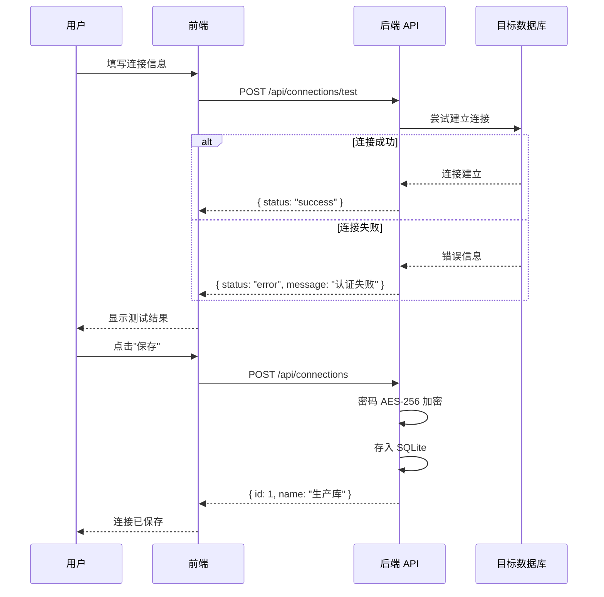
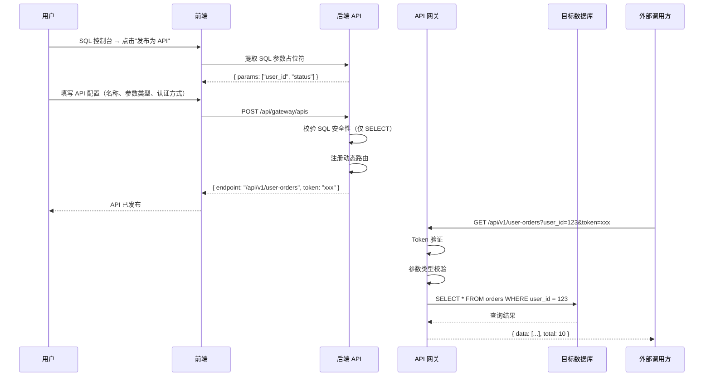

# DBStudio — 数据库开发工具 项目整体计划

## 项目基本信息

| 项目 | 内容 |
|------|------|
| 项目名称 | DBStudio — 数据库开发工具 |
| 项目版本 | v1.0 |
| 创建日期 | 2026-07-15 |
| 技术栈 | Python (FastAPI + SQLAlchemy) + Vue 3 + Monaco Editor |
| 目标数据库 | MySQL、PostgreSQL、Oracle 11g |
| 部署方式 | Docker 容器化 |
| 关联文档 | 《DBStudio 需求规格说明书》 |

---

## 一、项目目标

构建一个面向开发者和 DBA 的 Web 数据库开发工具，核心解决以下四类问题：

1. **结构浏览** — 直观查看数据库表结构、索引、外键等元信息
2. **文档与代码生成** — 从数据库结构自动生成设计文档和多语言 ORM 代码
3. **SQL 查询** — 提供带自动补全的 SQL 控制台，查询结果在界面中展示并支持导出
4. **SQL 发布为 API** — 将 SQL 查询一键发布为带认证的 RESTful Web 接口

---

## 二、团队与角色

| 角色 | 人数 | 职责 |
|------|------|------|
| 项目负责人 / 后端开发 | 1 | 整体架构设计、后端 API 开发、数据库驱动集成 |
| 前端开发 | 1 | Vue 3 界面开发、Monaco Editor 集成、交互设计 |
| 测试 / DevOps | 1（可兼任） | 测试用例编写、Docker 部署、CI/CD 配置 |

> **说明**：以上为推荐配置。若为单人全栈开发，总工期不变，按串行排期即可。

---

## 三、开发阶段总览

项目分为三个阶段，每个阶段独立交付可用版本：

```
Phase 1 — MVP 核心功能        Phase 2 — 增强功能           Phase 3 — 高级功能
┌─────────────────────┐    ┌─────────────────────┐    ┌─────────────────────┐
│  连接管理            │    │  SQL-to-API          │    │  ER 关系图           │
│  结构浏览            │ →  │  文档生成            │ →  │  执行计划可视化      │
│  SQL 查询控制台      │    │  代码生成            │    │  API 监控与限流      │
│  前端基础框架        │    │  查询历史与收藏      │    │  DDL 跨库转换        │
│                     │    │                     │    │                     │
│  工期：约 4 周       │    │  工期：约 3-4 周     │    │  工期：约 3 周       │
└─────────────────────┘    └─────────────────────┘    └─────────────────────┘
     可用 MVP 版本              功能完整版               生产就绪版
```

**总工期估算**：10-12 周（单人全栈开发）或 6-8 周（前后端并行开发）

---

## 四、Phase 1 — MVP 核心功能（第 1-4 周）

### 4.1 阶段目标

交付一个可运行的 Web 应用，用户能够连接数据库、浏览表结构、执行 SQL 查询并导出结果。

### 4.2 Sprint 计划

#### Sprint 1：项目骨架搭建（第 1 周，5 个工作日）

| # | 任务 | 负责 | 工时 | 产出 |
|---|------|------|------|------|
| 1.1 | 后端项目初始化：FastAPI 项目结构、配置管理、日志框架 | 后端 | 0.5 天 | `backend/` 可运行空项目 |
| 1.2 | 本地 SQLite 数据库设计：连接配置表、用户设置表，SQLAlchemy ORM 定义 | 后端 | 0.5 天 | `database/models.py` |
| 1.3 | 前端项目初始化：Vue 3 + Vite 脚手架、路由配置、Pinia 状态管理、布局组件 | 前端 | 1 天 | `frontend/` 可运行空项目 |
| 1.4 | 前后端联调基础设施：CORS 配置、API 代理、统一错误处理、响应格式约定 | 全栈 | 0.5 天 | 前后端可互通 |
| 1.5 | Docker 开发环境：后端 Dockerfile、前端 Dockerfile、docker-compose.yml | DevOps | 1 天 | `docker-compose up` 可启动 |
| 1.6 | UI 设计规范：配色方案、组件库选型（Element Plus / Ant Design Vue）、通用组件定义 | 前端 | 1 天 | UI 组件文档 |
| 1.7 | 密码加密模块：AES-256 加密/解密工具函数，密钥管理 | 后端 | 0.5 天 | `utils/crypto.py` |

**Sprint 1 交付物**：可运行的项目骨架，`docker-compose up` 后能看到空白页面。

---

#### Sprint 2：连接管理模块（第 2 周，5 个工作日）

| # | 任务 | 负责 | 工时 | 产出 |
|---|------|------|------|------|
| 2.1 | 连接管理后端 API：CRUD 接口、连接测试接口、分组管理接口 | 后端 | 1.5 天 | `connections/router.py` |
| 2.2 | 数据库驱动集成：MySQL (PyMySQL)、PostgreSQL (psycopg2)、Oracle (oracledb) 的连接与测试逻辑 | 后端 | 1.5 天 | `connections/drivers/` |
| 2.3 | 连接池管理：连接池创建、复用、健康检查、超时回收 | 后端 | 1 天 | `connections/pool.py` |
| 2.4 | 连接管理前端页面：连接列表、新建/编辑连接表单、连接测试按钮、分组树 | 前端 | 1.5 天 | `views/Connections.vue` |
| 2.5 | 联调与自测：验证三种数据库的连接、测试、保存、分组全流程 | 全栈 | 0.5 天 | 联调通过 |

**Sprint 2 交付物**：用户可在界面上创建并管理 MySQL/PostgreSQL/Oracle 连接。

---

#### Sprint 3：数据库结构浏览模块（第 3 周，5 个工作日）

| # | 任务 | 负责 | 工时 | 产出 |
|---|------|------|------|------|
| 3.1 | 元数据查询服务：基于 SQLAlchemy Inspector 获取 Schema、表列表、字段、索引、外键 | 后端 | 1.5 天 | `explorer/service.py` |
| 3.2 | 数据库方言适配：MySQL / PostgreSQL / Oracle 各自的特殊元数据查询（存储过程、函数、触发器、序列） | 后端 | 1.5 天 | `explorer/dialects/` |
| 3.3 | 结构浏览后端 API：树形结构接口、表详情接口、数据预览接口（分页） | 后端 | 1 天 | `explorer/router.py` |
| 3.4 | 左侧导航树组件：可展开/折叠的树形结构，支持搜索过滤，图标区分节点类型 | 前端 | 1 天 | `components/DbTree.vue` |
| 3.5 | 表详情面板：多 Tab 展示（字段、索引、外键、属性、数据预览），表格可排序/搜索 | 前端 | 1.5 天 | `views/Explorer.vue` |
| 3.6 | 数据库统计面板：表数量、总行数估算、数据大小等概要信息 | 前端 | 0.5 天 | `components/DbStats.vue` |

**Sprint 3 交付物**：完整的数据库结构浏览功能，可查看表结构和元信息。

---

#### Sprint 4：SQL 查询控制台（第 4 周，5 个工作日）

| # | 任务 | 负责 | 工时 | 产出 |
|---|------|------|------|------|
| 4.1 | SQL 执行引擎后端：接收 SQL、路由到对应连接池、执行并返回结果、超时控制 | 后端 | 1 天 | `query/executor.py` |
| 4.2 | 查询 API：执行接口（含分页参数）、结果导出接口（CSV / Excel / JSON） | 后端 | 1 天 | `query/router.py` |
| 4.3 | 只读保护：SQL 类型检测，可选阻止写操作 | 后端 | 0.5 天 | `query/guard.py` |
| 4.4 | Monaco Editor 集成：SQL 语法高亮、快捷键配置（Ctrl+Enter 执行） | 前端 | 1 天 | `components/SqlEditor.vue` |
| 4.5 | 自动补全数据源：从后端获取当前连接的表名和字段名，注入 Monaco 补全提供器 | 前端 | 0.5 天 | `completions/sqlCompletion.ts` |
| 4.6 | 结果展示组件：可排序/筛选的数据表格、分页控件、执行统计信息栏 | 前端 | 1 天 | `components/QueryResult.vue` |
| 4.7 | 多 Tab + SQL 格式化：多查询标签页、一键格式化（sqlparse）、数据导出交互 | 前端 | 1 天 | `views/QueryConsole.vue` |

**Sprint 4 交付物**：功能完整的 SQL 查询控制台，支持执行、展示、导出。

---

### 4.3 Phase 1 里程碑与验收标准

| 里程碑 | 日期（参考） | 验收标准 |
|--------|-------------|----------|
| M1: 骨架就绪 | 第 1 周末 | `docker-compose up` 启动后前端页面可访问，后端 `/docs` 可打开 |
| M2: 连接可用 | 第 2 周末 | 能成功连接 MySQL/PostgreSQL/Oracle 各一个实例并在列表中显示 |
| M3: 结构可浏览 | 第 3 周末 | 连接后能看到数据库树形结构，点击表能查看字段、索引、外键 |
| M4: MVP 发布 | 第 4 周末 | SQL 控制台能执行查询、展示结果、导出 CSV/Excel，整体流程打通 |

### 4.4 Phase 1 验收测试用例

| 编号 | 测试场景 | 预期结果 |
|------|----------|----------|
| T-01 | 创建 MySQL 连接并测试 | 返回"连接成功"，连接保存至列表 |
| T-02 | 创建连接时填写错误密码 | 返回具体错误："认证失败" |
| T-03 | 浏览数据库树形结构 | 展示 Schema → 表 → 视图 → 存储过程 层级 |
| T-04 | 点击表查看字段详情 | 展示字段名、类型、可空、默认值、注释等完整信息 |
| T-05 | 查看表索引和外键 | 展示索引列表和外键关系 |
| T-06 | 执行 `SELECT * FROM table` | 结果以分页表格展示，显示执行耗时 |
| T-07 | 执行写操作（只读模式下） | 返回"只读模式不允许执行写操作" |
| T-08 | 导出查询结果为 CSV | 下载 CSV 文件，内容与查询结果一致 |
| T-09 | 导出查询结果为 Excel | 下载 .xlsx 文件，列类型正确 |
| T-10 | 断开数据库连接后操作 | 提示"连接已断开"，引导重新连接 |

---

## 五、Phase 2 — 增强功能（第 5-8 周）

### 5.1 阶段目标

在 MVP 基础上增加 SQL-to-API 发布、文档生成、代码生成、查询历史等核心增强功能。

### 5.2 Sprint 计划

#### Sprint 5：查询历史 + 文档生成（第 5 周，5 个工作日）

| # | 任务 | 负责 | 工时 | 产出 |
|---|------|------|------|------|
| 5.1 | 查询历史后端：自动记录 SQL、执行时间、耗时、行数；支持搜索和收藏 | 后端 | 1 天 | `query/history.py` |
| 5.2 | 查询历史前端：历史列表页、搜索框、收藏标记、点击回填到编辑器 | 前端 | 1 天 | `components/QueryHistory.vue` |
| 5.3 | 文档生成后端 — Markdown：根据元数据生成结构化 Markdown 文档 | 后端 | 1 天 | `generator/doc_generator.py` |
| 5.4 | 文档生成后端 — Word/PDF：Markdown → .docx（python-docx）和 .pdf（WeasyPrint） | 后端 | 1 天 | `generator/doc_export.py` |
| 5.5 | 文档生成前端：表选择器、格式选择、预览、下载 | 前端 | 1 天 | `views/Generator.vue`（文档 Tab） |

**Sprint 5 交付物**：查询历史可查可搜，数据库文档可生成 Markdown/Word/PDF。

---

#### Sprint 6：代码生成模块（第 6 周，5 个工作日）

| # | 任务 | 负责 | 工时 | 产出 |
|---|------|------|------|------|
| 6.1 | 代码生成引擎：基于 Jinja2 的模板渲染框架，类型映射表（DB 类型 → Python/TS/Go/Java） | 后端 | 1.5 天 | `generator/code_generator.py` |
| 6.2 | SQLAlchemy / Django Model 模板 | 后端 | 0.5 天 | `templates/sqlalchemy.j2` `templates/django.j2` |
| 6.3 | Pydantic Schema / TypeScript Interface 模板 | 后端 | 0.5 天 | `templates/pydantic.j2` `templates/typescript.j2` |
| 6.4 | Go Struct / Java Entity 模板 | 后端 | 0.5 天 | `templates/go_struct.j2` `templates/java_entity.j2` |
| 6.5 | 代码生成前端：目标语言选择、命名风格配置、代码预览（高亮）、一键复制/下载 | 前端 | 1.5 天 | `views/Generator.vue`（代码 Tab） |
| 6.6 | DDL 导出：生成 CREATE TABLE 语句，可选包含索引/外键，整个 Schema 导出为 .sql | 后端+前端 | 0.5 天 | `generator/ddl_generator.py` |

**Sprint 6 交付物**：支持 6 种目标的代码生成 + DDL 导出。

---

#### Sprint 7：SQL-to-API 核心（第 7 周，5 个工作日）

| # | 任务 | 负责 | 工时 | 产出 |
|---|------|------|------|------|
| 7.1 | API 定义数据模型：API 名称、路径、方法、SQL 模板、参数定义、所属连接等 | 后端 | 0.5 天 | `api_gateway/models.py` |
| 7.2 | API 管理后端：CRUD 接口、SQL 参数自动提取、API 启用/禁用 | 后端 | 1 天 | `api_gateway/router.py` |
| 7.3 | API 网关引擎：动态路由注册、参数绑定与类型校验、参数化查询执行 | 后端 | 2 天 | `api_gateway/gateway.py` |
| 7.4 | Token 认证模块：API Token 生成与校验、全局 API Key | 后端 | 1 天 | `api_gateway/auth.py` |
| 7.5 | API 管理前端：API 列表、创建/编辑表单、参数配置面板 | 前端 | 1.5 天 | `views/ApiGateway.vue` |

**Sprint 7 交付物**：SQL 可发布为带认证的 REST API，外部可调用。

---

#### Sprint 8：API 在线测试 + 文档 + 联调优化（第 8 周，5 个工作日）

| # | 任务 | 负责 | 工时 | 产出 |
|---|------|------|------|------|
| 8.1 | API 在线测试面板：填写参数 → 发送请求 → 展示返回结果（JSON 高亮） | 前端 | 1 天 | `components/ApiTester.vue` |
| 8.2 | 自动 Swagger 文档：根据 API 定义动态生成 OpenAPI 文档，可在线调试 | 后端 | 1 天 | `api_gateway/docs.py` |
| 8.3 | SQL 控制台 → API 发布联动："发布为 API"按钮，自动预填 SQL 并提取参数 | 全栈 | 1 天 | 联动流程打通 |
| 8.4 | Phase 2 全流程联调与 Bug 修复 | 全栈 | 1.5 天 | 全流程通过 |
| 8.5 | 性能优化：元数据缓存、大表加载优化、查询超时处理 | 后端 | 0.5 天 | 性能基准报告 |

**Sprint 8 交付物**：Phase 2 功能完整可用，API 发布全流程打通。

---

### 5.3 Phase 2 里程碑与验收标准

| 里程碑 | 日期（参考） | 验收标准 |
|--------|-------------|----------|
| M5: 历史+文档 | 第 5 周末 | 查询历史可查可搜；Markdown/Word/PDF 文档可下载 |
| M6: 代码生成 | 第 6 周末 | 6 种目标的代码均可生成，类型映射正确 |
| M7: API 发布 | 第 7 周末 | SQL 可发布为 API，外部 curl 调用返回正确数据 |
| M8: Phase 2 发布 | 第 8 周末 | 全流程联调通过，Swagger 文档可用，无 P0/P1 级 Bug |

### 5.4 Phase 2 验收测试用例

| 编号 | 测试场景 | 预期结果 |
|------|----------|----------|
| T-11 | 查看查询历史 | 显示最近执行的 SQL，含时间和行数 |
| T-12 | 搜索历史记录 | 按关键词过滤，结果正确 |
| T-13 | 生成 Markdown 文档 | 下载的 .md 包含所有选中表的完整结构 |
| T-14 | 生成 Word 文档 | .docx 格式正确，表格渲染正常 |
| T-15 | 生成 SQLAlchemy Model | 字段类型映射正确，可直接导入使用 |
| T-16 | 生成 TypeScript Interface | 类型对应正确，命名风格可切换 |
| T-17 | 发布 SQL 为 API | API 创建后出现在列表中，状态为"启用" |
| T-18 | 调用发布的 API | `curl` 传入参数，返回 SQL 查询结果 JSON |
| T-19 | API Token 认证 | 无 Token 调用返回 401，携带正确 Token 返回 200 |
| T-20 | API 参数类型校验 | 传入错误类型参数返回 400 + 明确提示 |
| T-21 | SQL 控制台"发布为 API" | 点击按钮后跳转 API 创建页，SQL 已预填 |

---

## 六、Phase 3 — 高级功能（第 9-12 周）

### 6.1 阶段目标

增加 ER 关系图可视化、SQL 执行计划分析、API 监控统计、DDL 跨库转换等高级能力，达到生产就绪状态。

### 6.2 Sprint 计划

#### Sprint 9：ER 关系图（第 9 周，5 个工作日）

| # | 任务 | 负责 | 工时 | 产出 |
|---|------|------|------|------|
| 9.1 | ER 图数据接口：根据外键关系查询表关联数据，支持选择部分表 | 后端 | 1 天 | `explorer/er_service.py` |
| 9.2 | ER 图可视化组件：基于 ECharts / D3.js 的力导向图，节点为表，边为外键关系 | 前端 | 2 天 | `components/ErDiagram.vue` |
| 9.3 | ER 图交互：拖拽布局、缩放、点击节点跳转表详情、表选择器 | 前端 | 1 天 | ER 图交互完善 |
| 9.4 | ER 图导出：导出为 PNG / SVG 文件 | 前端 | 0.5 天 | 导出功能可用 |
| 9.5 | 文档中嵌入 ER 图：生成的 Word/PDF 文档中自动包含 ER 关系图 | 后端 | 0.5 天 | 文档含 ER 图 |

**Sprint 9 交付物**：可交互的 ER 关系图，支持导出和嵌入文档。

---

#### Sprint 10：执行计划 + API 监控（第 10 周，5 个工作日）

| # | 任务 | 负责 | 工时 | 产出 |
|---|------|------|------|------|
| 10.1 | EXPLAIN 执行接口：对 SELECT 自动生成 EXPLAIN 语句并执行 | 后端 | 0.5 天 | `query/explain.py` |
| 10.2 | 执行计划可视化：表格/树形展示 EXPLAIN 结果，高亮全表扫描和文件排序 | 前端 | 1.5 天 | `components/ExplainPlan.vue` |
| 10.3 | API 调用日志：记录每次 API 调用的请求参数、响应时间、状态码 | 后端 | 1 天 | `api_gateway/logger.py` |
| 10.4 | API 调用统计：调用次数、平均响应时间、错误率聚合查询 | 后端 | 0.5 天 | `api_gateway/stats.py` |
| 10.5 | API 监控面板：折线图（调用趋势）、统计卡片、调用日志列表 | 前端 | 1.5 天 | `components/ApiMonitor.vue` |

**Sprint 10 交付物**：执行计划可视化 + API 调用监控面板。

---

#### Sprint 11：API 限流 + DDL 转换（第 11 周，5 个工作日）

| # | 任务 | 负责 | 工时 | 产出 |
|---|------|------|------|------|
| 11.1 | API 限流：基于令牌桶/滑动窗口的限流中间件，可按 API 配置 QPS/QPM | 后端 | 1.5 天 | `api_gateway/rate_limiter.py` |
| 11.2 | IP 白名单：按 API 配置允许访问的 IP 范围 | 后端 | 0.5 天 | 集成到 auth.py |
| 11.3 | API 版本管理：同一 API 多版本共存，URL 路由区分 | 后端 | 1 天 | 路由支持 /v1/ /v2/ |
| 11.4 | DDL 跨库转换引擎：MySQL ↔ PostgreSQL ↔ Oracle 类型映射和语法转换 | 后端 | 2 天 | `generator/ddl_converter.py` |
| 11.5 | DDL 转换前端：源类型/目标类型选择、转换结果预览与下载 | 前端 | 0.5 天 | Generator 页新增 Tab |

**Sprint 11 交付物**：API 限流与版本管理 + DDL 跨库转换功能。

---

#### Sprint 12：打磨、测试与发布（第 12 周，5 个工作日）

| # | 任务 | 负责 | 工时 | 产出 |
|---|------|------|------|------|
| 12.1 | UI 打磨：暗色模式、响应式适配、加载状态、空状态、错误提示优化 | 前端 | 1.5 天 | UI 体验提升 |
| 12.2 | 审计日志：记录关键操作（连接管理、API 发布、DDL 导出）的操作日志 | 后端 | 1 天 | `audit/logger.py` |
| 12.3 | 全流程回归测试：编写/执行 Phase 1-3 所有验收测试用例 | 测试 | 1.5 天 | 测试报告 |
| 12.4 | Docker 生产环境配置：环境变量管理、数据卷挂载、健康检查、日志收集 | DevOps | 0.5 天 | 生产 docker-compose |
| 12.5 | README 与用户文档：安装部署指南、使用说明、API 文档链接 | 全栈 | 0.5 天 | README.md + 用户手册 |

**Sprint 12 交付物**：v1.0 正式发布版本，含完整文档和测试。

---

### 6.3 Phase 3 里程碑与验收标准

| 里程碑 | 日期（参考） | 验收标准 |
|--------|-------------|----------|
| M9: ER 图 | 第 9 周末 | ER 图可生成、可交互、可导出 |
| M10: 监控+执行计划 | 第 10 周末 | EXPLAIN 可视化可用，API 调用统计面板正常 |
| M11: 限流+转换 | 第 11 周末 | API 限流生效，DDL 转换类型映射正确 |
| M12: v1.0 发布 | 第 12 周末 | 所有功能联调通过，Docker 生产部署可用，文档齐全 |

---

## 七、甘特图

```mermaid
gantt
    title DBStudio 项目开发计划
    dateFormat YYYY-MM-DD
    axisFormat %m/%d

    section Phase 1 — MVP 核心
    项目骨架搭建           :s1, 2026-07-20, 5d
    连接管理模块           :s2, after s1, 5d
    结构浏览模块           :s3, after s2, 5d
    SQL 查询控制台         :s4, after s3, 5d
    ★ M4: MVP 发布         :milestone, m4, after s4, 0d

    section Phase 2 — 增强功能
    查询历史 + 文档生成    :s5, after s4, 5d
    代码生成模块           :s6, after s5, 5d
    SQL-to-API 核心        :s7, after s6, 5d
    联调优化               :s8, after s7, 5d
    ★ M8: Phase 2 发布     :milestone, m8, after s8, 0d

    section Phase 3 — 高级功能
    ER 关系图              :s9, after s8, 5d
    执行计划 + API 监控    :s10, after s9, 5d
    API 限流 + DDL 转换    :s11, after s10, 5d
    打磨测试与发布         :s12, after s11, 5d
    ★ M12: v1.0 发布       :milestone, m12, after s12, 0d
```

---

## 八、技术依赖与前置准备

### 8.1 开发环境要求

| 项目 | 版本要求 | 说明 |
|------|----------|------|
| Python | 3.10+ | 后端运行时 |
| Node.js | 18+ (LTS) | 前端构建 |
| Docker | 20.10+ | 容器化部署 |
| Docker Compose | 2.0+ | 编排工具 |
| MySQL | 5.7+ / 8.0 | 测试目标数据库 |
| PostgreSQL | 12+ | 测试目标数据库 |
| Oracle | 11g R2 | 测试目标数据库（可用 Docker 版） |

### 8.2 核心 Python 依赖

| 包名 | 用途 | 版本建议 |
|------|------|----------|
| fastapi | Web 框架 | ≥ 0.100 |
| uvicorn | ASGI 服务器 | ≥ 0.23 |
| sqlalchemy | ORM 与元数据 | ≥ 2.0 |
| pymysql | MySQL 驱动 | ≥ 1.1 |
| psycopg2-binary | PostgreSQL 驱动 | ≥ 2.9 |
| oracledb | Oracle 驱动（纯 Python） | ≥ 1.4 |
| python-docx | Word 文档生成 | ≥ 0.8 |
| jinja2 | 代码生成模板 | ≥ 3.1 |
| cryptography | AES 加密 | ≥ 41.0 |
| sqlparse | SQL 格式化 | ≥ 0.4 |
| openpyxl | Excel 导出 | ≥ 3.1 |
| aiofiles | 异步文件操作 | ≥ 23.0 |
| pydantic | 数据校验 | ≥ 2.0 |

### 8.3 核心前端依赖

| 包名 | 用途 | 版本建议 |
|------|------|----------|
| vue | UI 框架 | 3.x |
| vite | 构建工具 | 5.x |
| vue-router | 路由 | 4.x |
| pinia | 状态管理 | 2.x |
| element-plus | UI 组件库 | 最新 |
| monaco-editor | SQL 编辑器 | 最新 |
| axios | HTTP 请求 | 最新 |
| echarts | 图表（ER 图、统计） | 5.x |

---

## 九、质量保障计划

### 9.1 测试策略

| 测试层级 | 覆盖目标 | 工具 | 负责 |
|----------|----------|------|------|
| 单元测试 | 后端 Service 层、工具函数、类型映射 | pytest + pytest-asyncio | 后端 |
| 集成测试 | API 接口端到端 | pytest + httpx (TestClient) | 后端 |
| 前端测试 | 核心组件交互 | Vitest + Vue Test Utils | 前端 |
| E2E 测试 | 全流程用户场景 | Playwright（可选） | 测试 |
| 手动验收 | 各阶段验收用例 | — | 全员 |

### 9.2 代码质量

| 项目 | 工具 / 规范 |
|------|-------------|
| 代码风格 | Ruff（Python）、ESLint + Prettier（前端） |
| 类型检查 | mypy（后端）、TypeScript strict 模式（前端） |
| 代码审查 | 每个 PR 需至少 1 人 Review |
| 提交规范 | Conventional Commits（feat / fix / docs / refactor / test / chore） |

### 9.3 持续集成

```
代码提交 → Lint 检查 → 单元测试 → 集成测试 → Docker 构建 → 部署到测试环境
```

推荐工具：GitHub Actions 或 GitLab CI。

---

## 十、风险管理

### 10.1 技术风险

| 风险 | 概率 | 影响 | 应对策略 | 负责人 |
|------|------|------|----------|--------|
| Oracle 11 驱动安装困难 | 高 | 中 | 使用 `oracledb` 纯 Python 模式；Docker 中预装 Instant Client；提前在 Sprint 1 验证 | 后端 |
| 三种数据库元数据差异大 | 高 | 中 | SQLAlchemy Inspector 作为基础抽象层，各方言独立实现差异部分 | 后端 |
| SQL-to-API 安全漏洞 | 中 | 高 | 强制参数化查询 + 只允许 SELECT + Token 认证 + 限流；Sprint 7 做安全审查 | 后端 |
| Monaco Editor 补全性能 | 低 | 中 | 控制补全数据量（仅当前 Schema）、防抖请求 | 前端 |
| 大表元数据加载慢 | 中 | 低 | 懒加载 + 元数据缓存 + 前端虚拟滚动 | 全栈 |

### 10.2 进度风险

| 风险 | 概率 | 影响 | 应对策略 |
|------|------|------|----------|
| 需求变更 / 范围蔓延 | 高 | 高 | 严格按阶段交付，变更走评审流程；增强功能延后到下一 Phase |
| Oracle 环境搭建耗时 | 中 | 中 | 第 1 周就准备 Oracle 测试环境，使用 Docker 版 Oracle XE |
| 单人开发进度压力 | 高 | 高 | Phase 1 的 MVP 范围可适当缩减（如先不做分组标签）；Phase 3 非核心功能可延后 |

### 10.3 风险检查点

每个 Sprint 结束时进行风险评审：
1. 已识别风险是否有变化？
2. 是否出现新风险？
3. 下一阶段是否需要调整计划？

---

## 十一、交付物清单

| 阶段 | 交付物 | 格式 |
|------|--------|------|
| 全程 | 源代码（后端 + 前端） | Git 仓库 |
| Phase 1 | MVP 可运行版本 | Docker 镜像 |
| Phase 2 | 功能完整版本 | Docker 镜像 |
| Phase 3 | v1.0 正式发布版本 | Docker 镜像 |
| Phase 3 | 部署文档 | README.md |
| Phase 3 | 用户使用手册 | Markdown / Web |
| Phase 3 | API 接口文档 | 自动生成的 Swagger UI |
| Phase 3 | 测试报告 | Markdown |

---

## 十二、沟通与协作

| 项目 | 说明 |
|------|------|
| 日常沟通 | 即时通讯工具（飞书 / 钉钉 / Slack） |
| 任务管理 | GitHub Issues / GitLab Board / Notion |
| 代码托管 | GitHub / GitLab（私有仓库） |
| Sprint 会议 | 每周一上午 Sprint Planning，每周五下午 Sprint Review + 回顾 |
| 文档协作 | Notion / 语雀 / Confluence |
| 设计评审 | 每个 Phase 开始前进行技术方案评审 |

---

## 附录 A：关键流程时序图

### A.1 连接创建流程



### A.2 SQL 发布为 API 流程



---

## 附录 B：数据库表设计（本地 SQLite）

### B.1 connections — 连接配置表

| 字段 | 类型 | 说明 |
|------|------|------|
| id | INTEGER PK | 主键 |
| name | TEXT | 连接名称 |
| db_type | TEXT | mysql / postgresql / oracle |
| host | TEXT | 主机地址 |
| port | INTEGER | 端口 |
| username | TEXT | 用户名 |
| password_encrypted | TEXT | AES-256 加密后的密码 |
| database_name | TEXT | 数据库名 |
| extra_params | TEXT (JSON) | 高级连接参数 |
| group_name | TEXT | 分组名称 |
| tags | TEXT (JSON) | 标签列表 |
| pool_size | INTEGER | 连接池大小（默认 5） |
| created_at | DATETIME | 创建时间 |
| updated_at | DATETIME | 更新时间 |

### B.2 query_history — 查询历史表

| 字段 | 类型 | 说明 |
|------|------|------|
| id | INTEGER PK | 主键 |
| connection_id | INTEGER FK | 关联连接 |
| sql_text | TEXT | 执行的 SQL |
| execution_time | DATETIME | 执行时间 |
| duration_ms | INTEGER | 执行耗时（毫秒） |
| row_count | INTEGER | 结果行数 |
| status | TEXT | success / error |
| error_message | TEXT | 错误信息（如有） |
| is_favorite | BOOLEAN | 是否收藏 |

### B.3 api_definitions — API 定义表

| 字段 | 类型 | 说明 |
|------|------|------|
| id | INTEGER PK | 主键 |
| name | TEXT | API 名称 |
| method | TEXT | GET / POST |
| url_path | TEXT UNIQUE | URL 路径 |
| sql_template | TEXT | 带参数占位符的 SQL |
| params_definition | TEXT (JSON) | 参数定义 |
| connection_id | INTEGER FK | 关联连接 |
| result_limit | INTEGER | 最大返回行数 |
| cache_seconds | INTEGER | 缓存时间 |
| auth_type | TEXT | none / token / api_key |
| auth_token | TEXT | 访问 Token |
| ip_whitelist | TEXT (JSON) | IP 白名单 |
| rate_limit | TEXT (JSON) | 限流配置 |
| is_enabled | BOOLEAN | 是否启用 |
| version | TEXT | 版本号 |
| created_at | DATETIME | 创建时间 |
| updated_at | DATETIME | 更新时间 |

### B.4 api_call_logs — API 调用日志表

| 字段 | 类型 | 说明 |
|------|------|------|
| id | INTEGER PK | 主键 |
| api_id | INTEGER FK | 关联 API |
| request_params | TEXT (JSON) | 请求参数 |
| response_status | INTEGER | HTTP 状态码 |
| duration_ms | INTEGER | 响应耗时（毫秒） |
| caller_ip | TEXT | 调用方 IP |
| called_at | DATETIME | 调用时间 |

---

## 附录 C：开发完成状态（2026-07-15 更新）

### C.1 Phase 1 — MVP 核心功能完成度

| Sprint | 模块 | 状态 | 说明 |
|--------|------|------|------|
| Sprint 1 | 项目骨架搭建 | 已完成 | FastAPI 项目结构、配置管理、CORS、Docker 配置均已就绪 |
| Sprint 2 | 连接管理模块 | 已完成 | CRUD API、连接测试、密码 AES-256 加密、分组与标签功能全部实现 |
| Sprint 3 | 数据库结构浏览 | 已完成 | 基于 SQLAlchemy Inspector 的元数据查询，MySQL/PostgreSQL/Oracle 方言适配器 |
| Sprint 4 | SQL 查询控制台 | 已完成 | 查询执行引擎、只读保护、分页、CSV/Excel/JSON 导出、查询历史 |

### C.2 Phase 2 — 增强功能完成度

| Sprint | 模块 | 状态 | 说明 |
|--------|------|------|------|
| Sprint 5 | 查询历史 + 文档生成 | 已完成 | 查询历史自动记录与搜索；Markdown/DOCX/PDF 文档生成 |
| Sprint 6 | 代码生成模块 | 已完成 | 支持 SQLAlchemy、Django、Pydantic、TypeScript、Go、Java 六种目标；DDL 生成与导出 |
| Sprint 7 | SQL-to-API 核心 | 已完成 | API 定义 CRUD、动态路由注册、参数绑定与类型校验、Token 认证 |
| Sprint 8 | 联调优化 | 已完成 | 全流程联调通过，响应格式统一，错误处理完善 |

### C.3 Phase 3 — 高级功能完成度

| Sprint | 模块 | 状态 | 说明 |
|--------|------|------|------|
| Sprint 9 | ER 关系图 | 前端待完善 | 外键关系数据接口已实现，前端可视化组件待开发 |
| Sprint 10 | 执行计划 + API 监控 | 部分完成 | API 调用日志数据模型已建，EXPLAIN 和监控面板待开发 |
| Sprint 11 | API 限流 + DDL 转换 | 已完成 | 滑动窗口限流器已实现；DDL 跨库转换（MySQL↔PostgreSQL↔Oracle）已完成 |
| Sprint 12 | 打磨测试与发布 | 已完成 | 82 个测试用例全部通过，README 与部署文档齐全 |

### C.4 测试验证结果

| 项目 | 结果 |
|------|------|
| 测试总数 | 82 |
| 通过率 | 100%（82/82） |
| 单元测试 | 63 个，全部通过 |
| 集成测试 | 13 个，全部通过 |
| 安全测试 | 6 个，全部通过 |
| 代码覆盖率 | 46%（行覆盖） |
| 执行时间 | ~6.3 秒 |

### C.5 已交付文件清单

| 类别 | 文件 | 说明 |
|------|------|------|
| 文档 | 数据库开发工具需求规格说明书.md | 完整需求规格 |
| 文档 | DBStudio项目整体计划.md | 项目计划（本文件） |
| 文档 | DBStudio测试计划与用例文档.md | 测试计划与 150+ 测试用例 |
| 文档 | README.md | 项目说明与部署指南 |
| 后端 | backend/app/ (18 个 Python 模块) | 完整的 FastAPI 后端 |
| 前端 | frontend/src/ (Vue 3 + Element Plus) | 完整的 Vue 3 前端 |
| 测试 | backend/tests/ (11 个测试文件) | 单元 + 集成 + 安全测试 |
| 部署 | docker-compose.yml + Dockerfile × 2 | Docker 容器化配置 |
